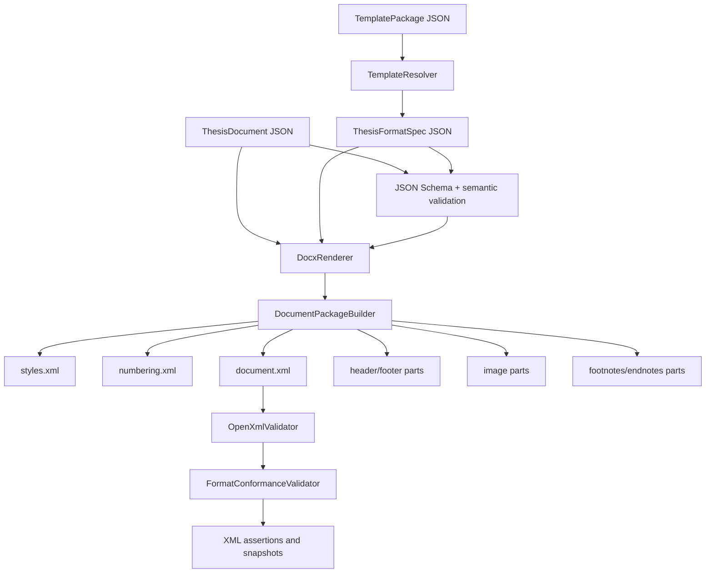

# Architecture

## Layers

`Models`
: JSON-serializable thesis content and format rule types.

`Rendering`
: package builder, style builder, numbering builder, section builder, header/footer builder, body and block renderers.

`OpenXml`
: shared constants such as style ids.

`Validation`
: JSON Schema validation, semantic input validation, OpenXML validation, format conformance validation, inspection, and snapshot normalization.

`Utilities`
: JSON settings and unit conversion helpers.

`Templates`
: template loading, registry listing, inheritance resolution, deterministic format-spec merge, variable and asset resolution, rule diff, and coverage reporting.

## Renderer Split

The renderer is intentionally decomposed:

- `DocumentPackageBuilder` owns package creation and part ordering.
- `StyleBuilder` owns `styles.xml`.
- `NumberingBuilder` owns multilevel and list numbering.
- `SectionBuilder` owns `sectPr`, page setup, margins, and page number format.
- `HeaderFooterBuilder` owns header/footer parts and PAGE field.
- `BodyRenderer` routes block nodes.
- `ParagraphRenderer`, `HeadingRenderer`, `TableRenderer`, `EquationRenderer`, `FigureRenderer`, `CaptionRenderer`, `FieldCodeRenderer`, `BibliographyRenderer`, and `NoteManager` own specific XML surfaces.
- `PageTemplateRenderer` renders the implemented cover/declaration page layout DSL into normal WordprocessingML paragraphs, tables, images, and page breaks.
- `CustomPropertiesWriter` records renderer and template metadata in safe custom document properties for later inspection.

Do not let a renderer read a college name and branch on it. Add declarative fields to `ThesisFormatSpec` instead.

## Template Resolution Flow

`TemplateLoader` reads `template.json`. `TemplateRegistry` lists sibling template directories. `TemplateResolver` recursively resolves `extends`, loads `formatSpec` or `formatSpecRef`, merges overrides, resolves variables/assets, and returns a `TemplateResolutionResult`. The CLI then validates the resolved format spec and renders with a `DocxRenderContext`.
